# Wine Quality Control System
### Built with Google Apps Script | Google Sheets | Google Drive | Gmail | clasp | GitHub

A full-stack Google Workspace automation that replaced a manual paper-based bottling QC process at a real winery - tracking runs from lab checks to production completion with automated reporting, email notifications, and audit trails.


---

## Demo

[](https://www.youtube.com/watch?v=Ilz1OeemCuE)
*Click to watch the full walkthrough — run creation, approval workflow, production checks, and automated reporting.*

---

## Dashboard Overview

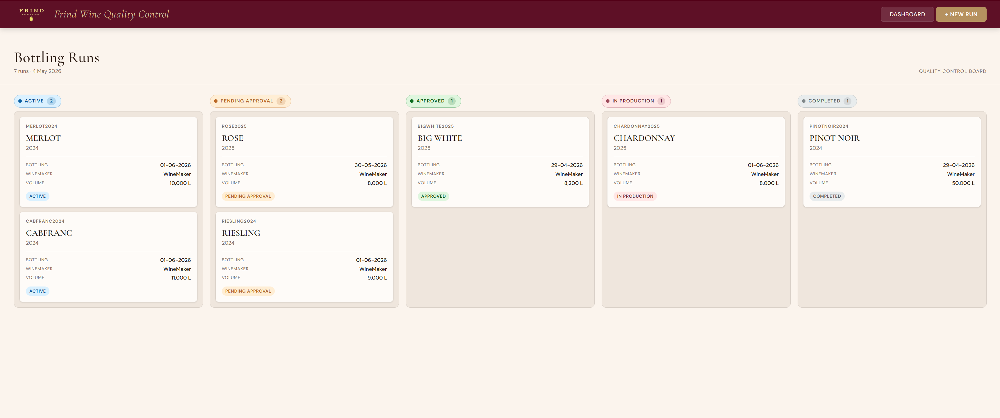
*The Kanban dashboard showing bottling runs distributed across five status columns — Active, Pending Approval, Approved, In Production, and Completed.*

---

## The Problem

Before this system, the bottling QC process ran entirely on manual effort: Excel files passed between staff, verbal sign-offs from winemakers and lab managers, paper forms filled out during production, and no audit trail when records needed to be retrieved.

The concrete costs:
- Hourly quality checks during production were missed with no reminder mechanism
- Pre-bottling lab and warehouse checks had no structured sign-off path
- Incomplete records were common because forms had no enforcement
- Staff manually created and filed Drive folders and Bottling Report documents before every run - a repetitive task that consumed significant time
- There was no single source of truth for run status across departments

---

## The Solution

A Google Apps Script web app that manages the full bottling run lifecycle across 8 structured phases:

1. **Run creation** - staff enter run details (wine, vintage, volume, dates) via a web form; the system immediately creates a dedicated Drive folder and copies a Bottling Report template into it
2. **Parallel pre-bottling checks** - the Lab Pre-Bottling and Warehouse checks can be completed independently; each submission writes to the database and populates the corresponding tab in the Bottling Report
3. **Structured approval workflow** - once pre-checks are complete, the run enters Pending Approval; the Winemaker and Lab Manager each approve independently via the web app, with email notifications at each step
4. **Day-before check** - lab staff submit chemistry targets and actuals the day before production; data writes to the database and the report simultaneously
5. **Day-of check with split-submission** - the morning of production, the operator and lab tech submit separate forms that merge into a single database row; production cannot start until both submit
6. **Hourly check reminders** - when production starts, an installable time-based trigger fires every hour and emails the lab and operator form links keyed to that specific check hour
7. **Hourly split-submission** - each hourly check follows the same merge pattern: operator submits machine readings, lab submits analytical results; both land in one row identified by Run ID + check hour
8. **Run completion and archiving** - when production ends, the report is finalized across all tabs, the Drive folder is moved from Active to Completed, and triggers for that session are deleted

Multi-day runs are fully supported: after each production session ends, the run returns to Approved status and waits for the next session's day-of check before restarting the production cycle.

---

## Workflow Architecture

```
New Run Created (web form)
    └── Drive folder + Bottling Report copy created automatically
            └── Lab Pre-Bot checks (multi-entry, any time)
            └── Warehouse check (single sign-off)
                    └── Send for Approval
                            └── Winemaker approves (email notification)
                            └── Lab Manager approves (email notification)
                                    └── Status → Approved
                                            └── Day Before Check (lab)
                                            └── Day Of Check (operator + lab split-submission)
                                                    └── Start Production
                                                            └── Hourly trigger fires every hour
                                                            └── Email → Lab form link + Operator form link
                                                            └── Both submissions merge into one row
                                                    └── End Production → back to Approved (multi-day)
                                            └── Run Complete
                                                    └── Bottling Report finalized
                                                    └── Drive folder archived to Completed Runs
                                                    └── Completion email with report link sent
```

---

## Screenshots

### Run Detail Modal — Active State
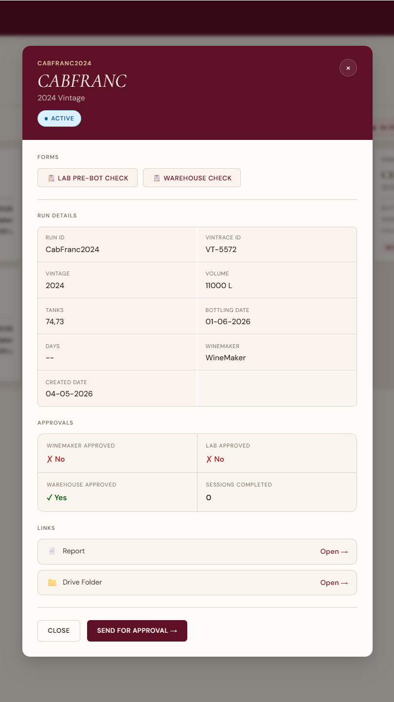

*Clicking a run card opens a modal showing full run details, approval status, and context-aware action buttons. Available actions change based on the current status.*

### Run Detail Modal — Pending Approval
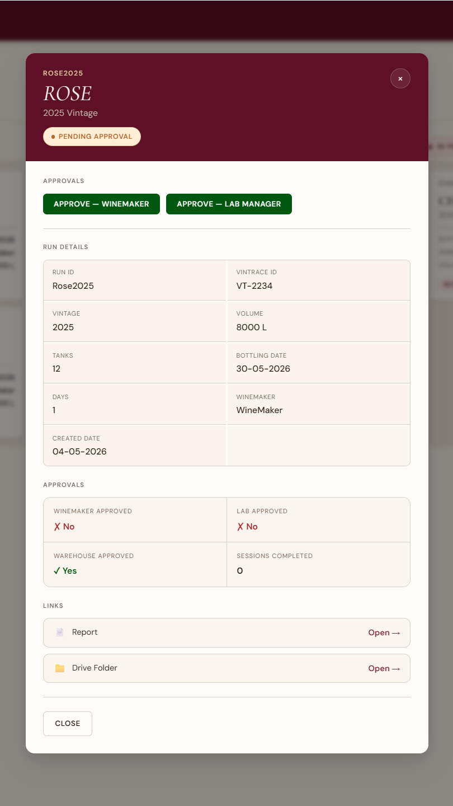

*When a run is pending approval, the Winemaker and Lab Manager each see their individual approval button. The system tracks which approvals are complete and auto-promotes the run when both are received.*

### New Run Form
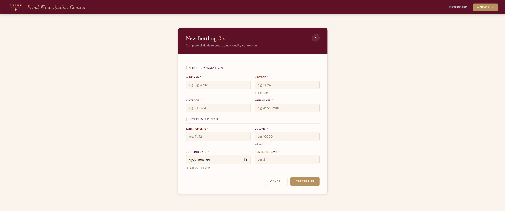

*The New Run form. On submission, the system generates a unique Run ID, creates a Drive folder, copies the Bottling Report template, and notifies all relevant staff.*

### Check Form — Lab Pre-Bottling
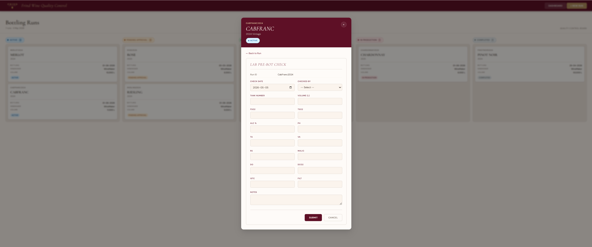

*The Lab Pre-Bottling check form. Multiple entries can be submitted over days or weeks. Each submission writes to both the master database and the Bottling Report Lab Pre-Bot tab simultaneously.*

### Check Form — Day Of Check (Split-Submission)
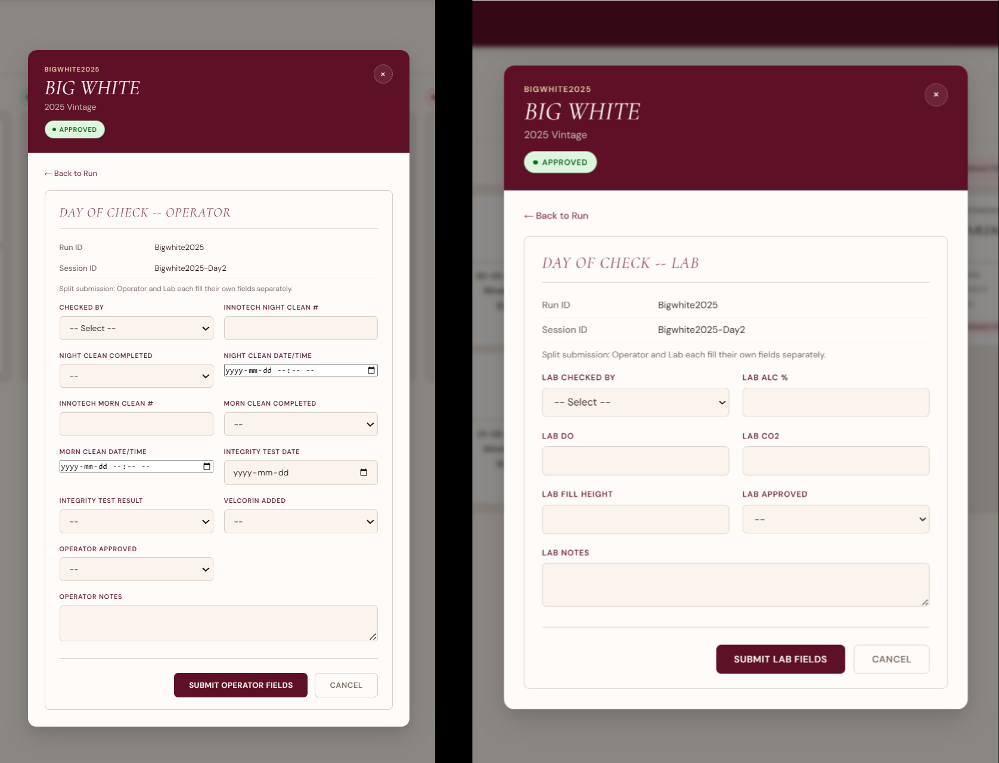

*The Day-of-Bottling check uses a split-submission pattern. The operator and lab tech each receive a separate form link showing only their fields. Both submissions merge into one database row — the row is marked complete only when both have submitted.*

### Hourly Check Reminder Email
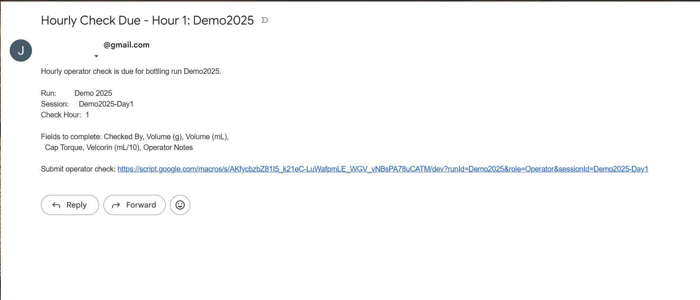

*The automated hourly reminder email sent during production. Each email contains direct form links pre-keyed to the run ID, session ID, and check hour. The lab link shows lab fields; the operator link shows operator fields.*

### Hourly Check Form — Operator View
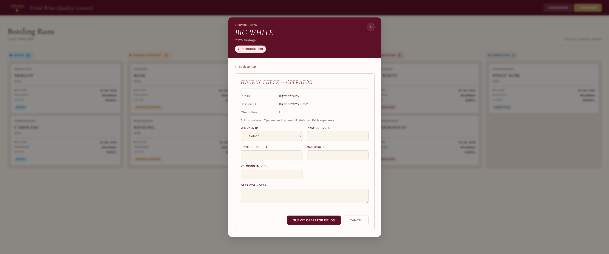

*The operator's hourly check form showing machine readings: Innotech DO In/Out, cap torque, Velcorin dosing.*

### Hourly Check Form — Lab View
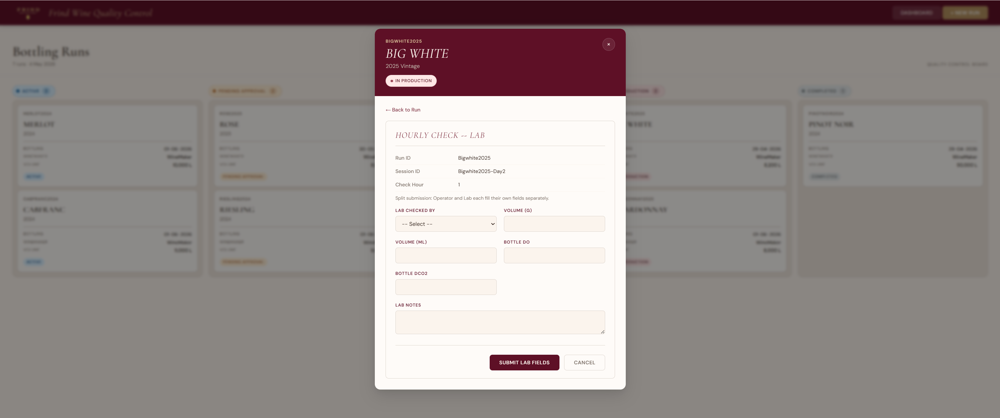

*The lab's hourly check form showing analytical readings: fill volume (g and mL), Bottle DO, Bottle DCO2.*

### Bottling Report — Run Summary Tab
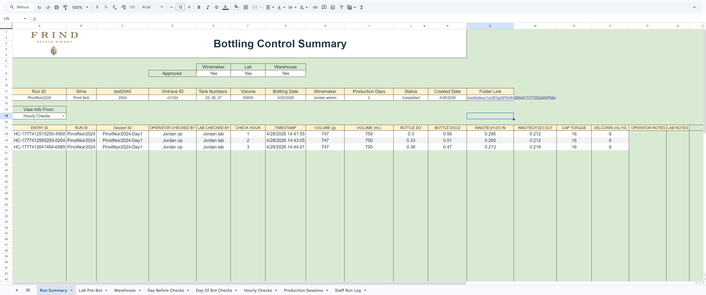

*The Bottling Report is a Google Sheet copied from a template on run creation. The Run Summary tab is populated automatically with run details and approval status, and updated again on completion.*

### Bottling Report — Hourly Checks Tab
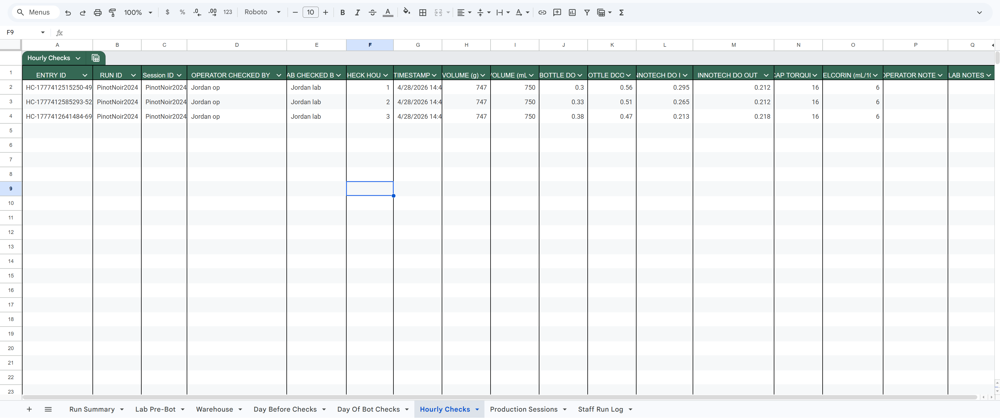

*The Hourly Checks tab in the Bottling Report, showing merged operator and lab data across all production hours. All data is written automatically — no manual entry into the report at any point.*

### Master Database — RUNS Sheet
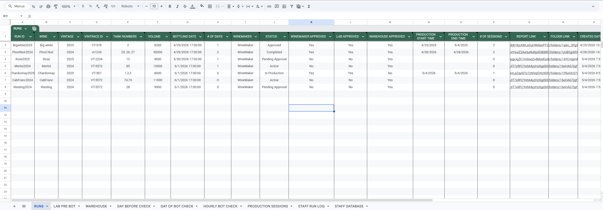

*The RUNS sheet in the Bottling Master Database. Every run, every status change, every approval timestamp, and every Drive link is stored here. The database grows with every run and is immediately available for trend analysis.*

### Google Drive — Active Runs Folder
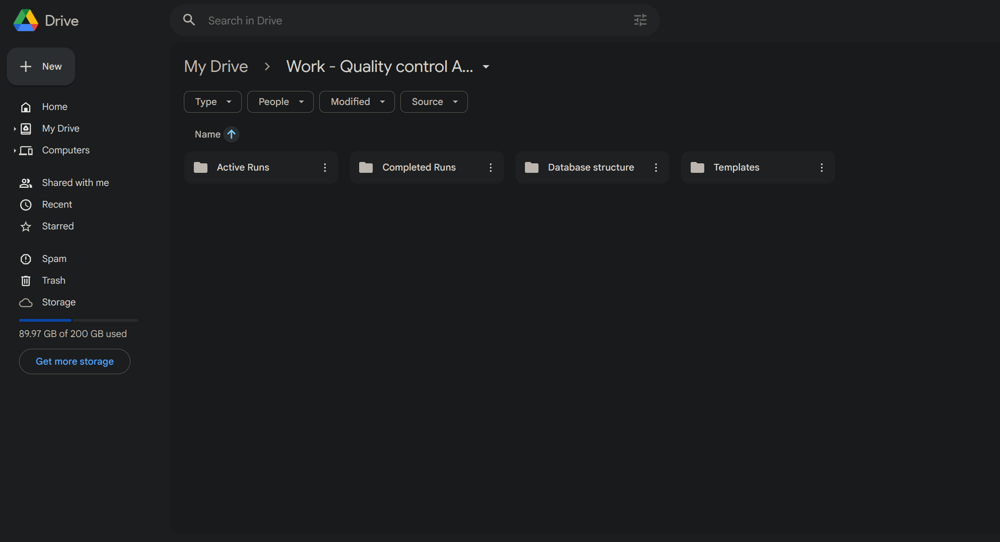
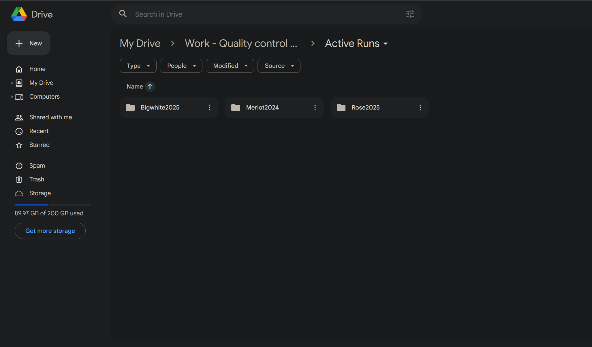
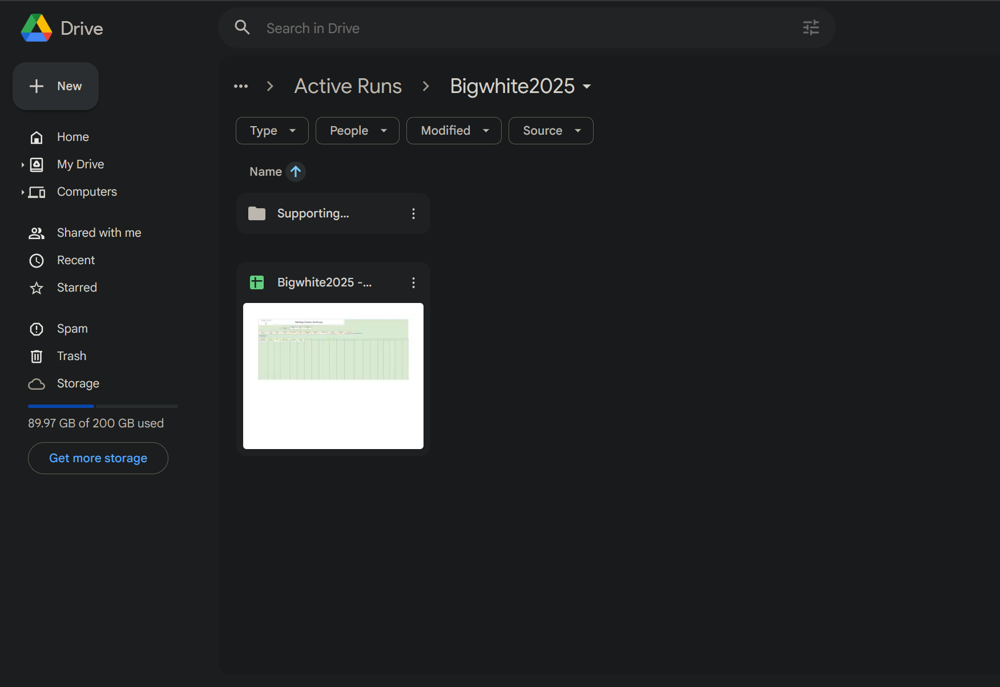

*The Drive folder structure created automatically on run creation. Each run gets its own named subfolder containing the Bottling Report and a Supporting Documents folder. On completion, the folder moves to Completed Runs automatically.*

### Apps Script Trigger Management
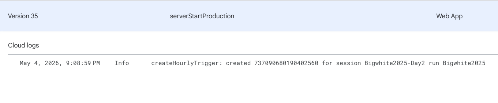

*The Apps Script Triggers panel showing a live hourly trigger for an active production session. The trigger is created when production starts and deleted automatically when the session ends.*

---

## Key Technical Features

- **Google Apps Script web app** served via `HtmlService` - no external hosting, no server to maintain
- **Google Sheets as a relational database** - 9 sheets with foreign key relationships via Run ID; column indexes defined as named constants and shared across all database functions
- **Automated Drive folder creation and report generation** - on run creation, `DriveManager.gs` creates a named subfolder under the Active Runs folder and copies the Bottling Report template into it, returning links stored in the RUNS sheet
- **Installable time-based triggers** - `HourlyTriggers.gs` creates one `ScriptApp` trigger per active production session, stores the trigger ID and session metadata in `PropertiesService`, and deletes both when the session ends; orphaned triggers are cleaned up on every hourly execution
- **Split-submission pattern** - two separate form links per check period (one lab, one operator) merge into a single database row using an upsert function with `LockService` preventing race conditions when both submit simultaneously
- **`PropertiesService` for all configuration** - Spreadsheet ID, Drive folder IDs, template file IDs, and trigger metadata are all stored as script properties; nothing is hardcoded
- **`LockService` on all concurrent writes** - any write path that could receive simultaneous submissions acquires a script lock before reading and updating the row
- **Role-based email routing** - recipient lists are assembled dynamically from the STAFF DATABASE sheet by department and role, not hardcoded addresses
- **Report population on submission** - every form submission triggers a corresponding write to the Bottling Report in Drive, keeping the shareable document in sync with the database in real time

---

## Long-Term Data Value

Every action in the system - lab checks, approvals, hourly readings, session timestamps, staff logs - is written to the master database and never overwritten. The system is not just an operational tool: it is a structured data archive that compounds in value over time.

Because all records live in Google Sheets, the full dataset is immediately available for analysis without any export or ETL process. Pivot tables, charts, and dashboards can be built directly on live production data - tracking chemistry trends across vintages, equipment performance via DO and torque readings, approval turnaround times, and seasonal volume patterns.

The same architecture applies to any operation that currently runs on manual records and verbal sign-offs.

---

## System Architecture

```
Browser (HtmlService)
        |
        | google.script.run (async RPC)
        v
Code.gs (server bridge - one wrapper per server function)
        |
        +---> RunManager.gs     (status transitions, validation)
        +---> Database.gs       (all Sheets read/write, column maps)
        +---> DriveManager.gs   (folder creation, archiving)
        +---> EmailService.gs   (notifications, hourly reminders)
        +---> ReportService.gs  (Bottling Report tab population)
        +---> HourlyTriggers.gs (trigger lifecycle management)
        |
        v
Google Sheets (RUNS, LAB PRE BOT, WAREHOUSE, DAY BEFORE CHECK,
               DAY OF BOT CHECK, HOURLY BOT CHECK,
               PRODUCTION SESSIONS, STAFF RUN LOG, STAFF DATABASE)

Google Drive  (Active Runs folder / Completed Runs folder / Templates)

Gmail         (approval notifications, hourly check reminders)
```

---

## Tech Stack

| Layer | Technology | Purpose |
|---|---|---|
| Runtime | Google Apps Script (V8) | Server-side logic, trigger execution |
| Database | Google Sheets | Structured data storage, 9 sheets |
| File storage | Google Drive | Run folders, Bottling Report documents |
| Email | Gmail API (GmailApp) | Notifications and reminders |
| UI | HtmlService | Web app served from Apps Script |
| Local dev | clasp | Push/pull code without the browser editor |
| Version control | GitHub | Source history and deployment reference |

---

## What I Built

**Relational data model in Google Sheets**
Designed 9 sheets with a shared Run ID foreign key, named column-index maps (`RUNS_COLUMNS`, `HOURLY_COLUMNS`, `DOB_COLUMNS`, etc.) that are the single source of truth for all read/write operations, and a row-to-object mapper that handles date serialization across the `google.script.run` boundary.

**Installable trigger management system**
Built a full lifecycle for per-session time-based triggers: `createHourlyTrigger()` creates the trigger via `ScriptApp`, stores its unique ID and session metadata in `PropertiesService`, and `deleteHourlyTrigger()` looks up and removes both the trigger and its stored metadata. A `cleanupOrphanedTriggers()` function runs at the start of every hourly execution to catch any triggers whose run is no longer In Production.

**Split-submission race condition solution**
Two users (lab tech and operator) submit separate forms that must land in the same database row. The upsert functions (`upsertHourlyCheck`, `upsertDayOfBotCheck`) acquire a `LockService` script lock, check whether a row for that Run ID + check hour already exists, update the existing row if found or create a new partial row if not, and only trigger report population once both submissions are present and the row is marked complete.

**Multi-day production session model**
Each production day creates a `PRODUCTION SESSIONS` row keyed by a Session ID (`RunID-Day1`, `RunID-Day2`, etc.). The run status loops between Approved and In Production for each session. Day-of checks, hourly checks, and triggers are all keyed to the session rather than the run, so records from different days remain distinct in the database and in the Bottling Report.

**Automated report population across 7 Bottling Report tabs**
`ReportService.gs` contains one append function per check type. Each function opens the run's Drive document by ID (stored in the RUNS sheet), locates the correct tab, and writes the submission data to the next available row - all triggered automatically on form submission rather than as a manual export step.

---

## Setup and Deployment

### Prerequisites
- A Google account with access to Google Drive and Google Sheets
- [clasp](https://github.com/google/clasp) installed (`npm install -g @google/clasp`)
- A copy of the Bottling Report template in your Drive

### Steps

1. **Clone the repository**
   ```bash
   git clone https://github.com/J-Ride/Wine-QC-System.git
   cd Wine-QC-System/apps-script
   ```

2. **Log in to clasp**
   ```bash
   clasp login
   ```

3. **Create a new Apps Script project**
   ```bash
   clasp create --type standalone
   ```
   This creates a `.clasp.json` file binding the local directory to the new project.

4. **Push the code**
   ```bash
   clasp push
   ```

5. **Create the Google Sheets database**
   Create a new spreadsheet with these 9 sheets, in this order:
   `RUNS`, `LAB PRE BOT`, `WAREHOUSE`, `DAY BEFORE CHECK`, `DAY OF BOT CHECK`, `HOURLY BOT CHECK`, `PRODUCTION SESSIONS`, `STAFF RUN LOG`, `STAFF DATABASE`

   See `docs/database-schema.md` for column definitions for each sheet.

6. **Run initial configuration**
   In `Config.gs`, replace the placeholder values in `setupConfig()` with your real IDs:
   - `SPREADSHEET_ID` - the ID from your database spreadsheet URL
   - `ACTIVE_RUNS_FOLDER_ID` - Drive folder for in-progress runs
   - `COMPLETED_RUNS_FOLDER_ID` - Drive folder for archived runs
   - `TEMPLATE_FOLDER_ID` - Drive folder containing the report template
   - `TEMPLATE_FILE_ID` - file ID of the Bottling Report template

   Run `setupConfig()` once from the Apps Script editor, then revert the hardcoded values. Configuration is now stored in `PropertiesService` and persists across deployments.

7. **Deploy as a web app**
   In the Apps Script editor: Deploy > New Deployment > Web App
   - Execute as: Me
   - Who has access: (your organization or specific users)
   - Copy the deployment URL

---

## Repository Structure

```
Wine-QC-System/
├── apps-script/
│   ├── Code.gs                 - doGet() entry point; server bridge wrappers for all client-callable functions
│   ├── Config.gs               - PropertiesService setup; getConfig(), getSpreadsheet(), getSheet() helpers
│   ├── Database.gs             - All Sheets read/write; column index maps; row-to-object mappers
│   ├── RunManager.gs           - Run creation, status transitions (Active -> Pending -> Approved -> In Production -> Completed)
│   ├── DriveManager.gs         - Drive folder creation on run start; folder archiving on completion
│   ├── EmailService.gs         - Approval notifications; hourly check reminder emails with form links
│   ├── HourlyTriggers.gs       - Installable trigger create/delete lifecycle; orphan cleanup
│   ├── ReportService.gs        - Bottling Report tab population (one function per check type)
│   ├── Utils.gs                - Date formatting (America/Vancouver), entry ID generation
│   ├── appsscript.json         - Apps Script manifest (V8 runtime, OAuth scopes)
│   └── html/
│       ├── Index.html          - Shell page; loads all view partials, handles client-side routing
│       ├── Styles.html         - Global CSS (design system, component styles)
│       ├── LogoData.html       - Base64 logo asset
│       ├── RunDetail.html      - Run detail modal (status, approvals, check history)
│       ├── LabPreBot.html      - Lab Pre-Bottling check form
│       ├── WarehouseCheck.html - Warehouse check form
│       ├── DayBeforeCheck.html - Day-before lab check form
│       ├── DayOfCheck.html     - Day-of split-submission check form (lab + operator)
│       ├── HourlyCheck.html    - Hourly split-submission check form (lab + operator)
│       └── StaffRunLog.html    - Production staff hours log (multi-row entry)
├── docs/
│   ├── README.md               - This file
│   ├── database-schema.md      - Column definitions for all 9 sheets
│   ├── status-flow.md          - Run lifecycle state machine documentation
│   ├── architecture.md         - System architecture notes
│   └── deployment.md           - Deployment checklist
└── .gitignore
```


---

*Part of Jordan Rideout's Automation Portfolio*
*Built to demonstrate real-world automation capability for operations and AI enablement roles*
